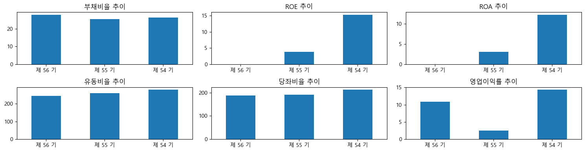

# 삼성전자 재무제표 분석 (2022-2024)

## 📊 프로젝트 개요
삼성전자의 최근 3개년 재무제표를 분석하여 주요 재무비율을 계산하고 시각화

## 🎯 분석 내용
- **안정성 비율**: 부채비율, 유동비율, 당좌비율
- **수익성 비율**: ROE, ROA, 영업이익률
- **추세 분석**: 3개년 비교

## 🛠 사용 기술
- Python 3.x
- Pandas (데이터 처리)
- Matplotlib (시각화)
- Jupyter Notebook

## 📁 파일 구조
<pre>
├── port01.py # 메인 분석 코드
├── 삼성전자_재무제표.xlsx # 원본 데이터
├── matplot.png # 결과 그래프
└── README.md
</pre>

## 🚀 실행 방법
jupyter notebook port01.py

## 📈 주요 결과

### 2024년 재무비율 (제56기)
| 비율 | 수치 | 평가 |
|------|------|------|
| 부채비율 | 27.93% | 안정적 |
| 유동비율 | 243.3% | 우수 |
| 당좌비율 | 187.84% | 우수 |
| ROE | 9.47% | 양호 |
| ROA | 7.56% | 양호 |
| 영업이익률 | 10.88% | 개선 |

---

## 💡 인사이트

### 1. 재무 안정성 우수
- 부채비율 27.93% → 업계 평균(50%) 대비 낮음
- 유동비율 243% → 단기채무 2.4배 커버 가능
- 당좌비율 187.84% → 재고 제외해도 안전

### 2. 수익성 회복 추세
- ROE: 4.37%(2023) → 9.47%(2024) **2배 증가**
- 영업이익률: 2.54%(2023) → 10.88%(2024) **4배 증가**
- 반도체 업황 회복 영향

### 3. 자산 효율성 개선
- ROA: 3.45%(2023) → 7.56%(2024)
- 총자산 대비 수익 창출 능력 향상

## 📚 배운 점
Pandas로 재무제표 데이터 처리
shift() 함수로 전기 데이터 활용
Matplotlib 서브플롯 레이아웃